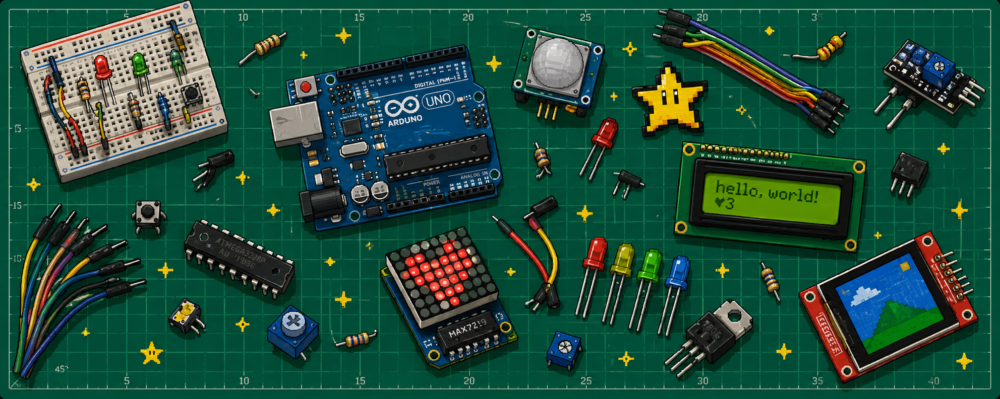

  

## ⭐ Welcome to My Personal Lab

I'm a Computer Engineering student passionate about turning ideas into hardware projects, one circuit at a time.

🛠 Interests
- Embedded Systems
- Electronics
- Arduino
- PyQt
- Microcontrollers & Microprocessors
- Circuit Design

💻 Languages
- C
- Python
- Arduino (C++)
- Assembly

🎯 Current Goal
Building a Mini Retro Game Console!

